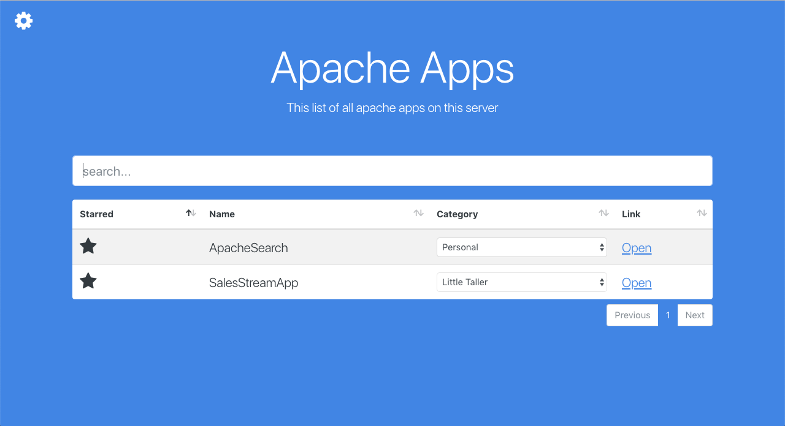

# Apache Search

An app for your apache root

### Setup

1. Download zip file from repo and open it into your apache root
2. Create `index.php` in your apache root and paste
 `<?php require 'ApacheSearch/index.php'; ?>` into said file.
3. Begin using Apache Search

### Shortcuts

1. Press `tab` to toggle to settings
2. Press `enter` to open app on home page
3. Press `enter` to add category on settings page
